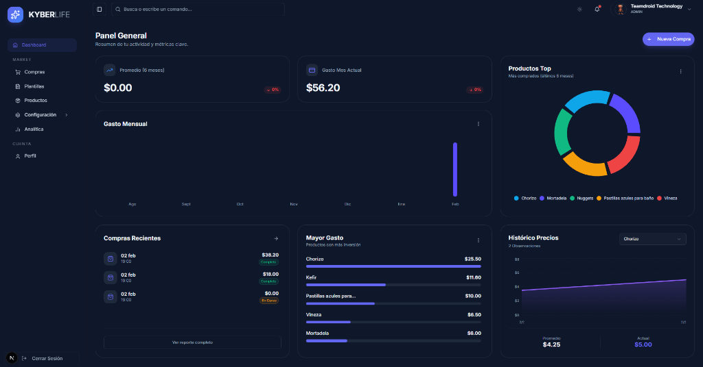

# Kyber Life (V1)




Plataforma de control de procesos personales cotidianos. Gestiona tus gastos, supermercados y compras de manera eficiente para tomar mejores decisiones financieras.

## 🚀 Funcionalidades del Sistema

### 🔐 Autenticación y Seguridad
- **Login y Registro**: Sistema completo de acceso para usuarios con diseño optimizado.
- **Recuperación de Contraseña**: Flujo funcional para restablecer credenciales (`/auth/recover`).
- **Control de Sesión Inteligente**: Guardian de inactividad con 15 minutos de límite, modal de advertencia con countdown de 30 segundos y sincronización de cierre de sesión entre pestañas (`storage` event). Refresco proactivo del JWT de Supabase cuando queda menos de 5 minutos de vida.

### 🛒 Gestión de Mercado
- **Dashboard Interactivo**: Métricas de consumo, gráficos de tendencias y acceso rápido a operaciones frecuentes.
- **Supermercados**: Administra tus lugares de compra, direcciones y preferencias.
- **Productos (Items)**: Catálogo personalizable con soporte para marcas, alias y unidades de medida globales (por defecto "und").
- **Listas de Compra Inteligentes**: 
  - Crea listas dinámicas desde plantillas o desde cero.
  - Registro de precios en tiempo real con cálculo automático de totales.
  - Soporte para validación de impuestos y descuentos.
- **Plantillas**: Guarda tus listas recurrentes para generar nuevas compras con un solo clic.

### 📊 Análisis y Control
- **Historial de Compras**: Registro detallado de todas tus transacciones pasadas.
- **Analytics**: Tableros visuales con gráficos de gasto mensual, distribución por categorías y productos más comprados.

### 👤 Perfil de Usuario
- **Gestión Integral**: Personalización de perfil, cambio de contraseña y gestión de datos personales.
- **Configuración**: Ajustes de preferencias de usuario.

## 🛠️ Aspectos Técnicos

### Stack Tecnológico
- **Frontend**: [Next.js 16](https://nextjs.org/) (App Router) para una experiencia rápida y optimizada para SEO.
- **UI & Estilos**: [React 19](https://react.dev/), [TailwindCSS](https://tailwindcss.com/) v4 y componentes accesibles de [Shadcn/ui](https://ui.shadcn.com/).
- **Lenguaje**: TypeScript para un desarrollo robusto y seguro.
- **Gráficos**: Recharts para visualización de datos.

### Arquitectura
El proyecto sigue estrictamente los principios de **Clean Architecture** para asegurar mantenibilidad, escalabilidad y separación de responsabilidades:

- **`src/domain`**: Contiene las entidades del negocio y reglas independientes del framework.
- **`src/application`**: Define los casos de uso y la lógica de la aplicación.
- **`src/infrastructure`**: Implementaciones concretas de repositorios, adaptadores y servicios externos.
- **`src/presentation`**: Capa de interfaz de usuario (Componentes, Páginas, Validadores).

### Persistencia de Datos
El sistema soporta múltiples estrategias de persistencia configurables vía `.env`:

1. **`SUPABASE`** *(Producción)*: Base de datos Postgres en la nube con autenticación y RLS.
2. **`MEMORY`** *(Desarrollo)*: Datos volátiles en memoria, sin dependencias externas.
3. **`MOCK`** *(Desarrollo)*: Datos cargados desde JSON con usuarios y compras de prueba.

#### Variables de Entorno

Renombra `.env.example` a `.env` y configura las variables:

| Variable | Requerida | Descripción |
|---|---|---|
| `DATA_SOURCE` | ✅ | Estrategia del servidor: `SUPABASE` \| `MEMORY` \| `MOCK` |
| `NEXT_PUBLIC_AUTH_STRATEGY` | ✅ | Debe coincidir con `DATA_SOURCE` (accesible en el cliente) |
| `NEXT_PUBLIC_SUPABASE_URL` | Solo Supabase | URL del proyecto en Supabase |
| `NEXT_PUBLIC_SUPABASE_ANON_KEY` | Solo Supabase | Clave anónima pública de Supabase |
| `NEXT_PUBLIC_SESSION_TIMEOUT_MS` | ❌ Opcional | Tiempo de inactividad en ms antes de cerrar sesión. Default: `1800000` (30 min) |

> **Nota:** `DATA_SOURCE` y `NEXT_PUBLIC_AUTH_STRATEGY` deben tener **el mismo valor**. Next.js no expone variables sin prefijo `NEXT_PUBLIC_` al navegador; por eso existen las dos.

#### Configuración para Supabase
```bash
DATA_SOURCE=SUPABASE
NEXT_PUBLIC_AUTH_STRATEGY=SUPABASE
NEXT_PUBLIC_SUPABASE_URL=https://tu-proyecto.supabase.co
NEXT_PUBLIC_SUPABASE_ANON_KEY=tu-anon-key
```

#### Configuración para desarrollo (sin Supabase)
```bash
DATA_SOURCE=MOCK
NEXT_PUBLIC_AUTH_STRATEGY=MOCK
# Usuario de prueba: test@test.com / test
```

## 🧪 Preparación y Pruebas

El proyecto cuenta con una suite de pruebas unitarias configurada con **Jest** y **React Testing Library**.

### Ejecutar Pruebas
Para validar la integridad del sistema y correr todos los tests disponibles:

```bash
npm test
```

## 🚀 Guía de Ejecución

### Requisitos Previos
- Node.js 18.17 o superior.
- npm (Node Package Manager).

### Instalación
Clona el repositorio e instala las dependencias:

```bash
npm install
```

### Modo Desarrollo
Para iniciar el entorno de desarrollo local con recarga en caliente:

```bash
npm run dev
```
La aplicación estará disponible en [http://localhost:3000](http://localhost:3000).

### Modo Producción
Para compilar y ejecutar la versión optimizada para producción:

1.  **Construir**:
    ```bash
    npm run build
    ```
    *(Nota: La configuración actual permite el build ignorando errores de linting no críticos).*

2.  **Iniciar**:
    ```bash
    npm start
    ```

---

Desarrollado por Teamdroid 🤖
