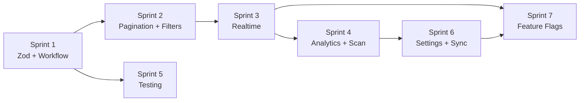

# KyberLife Financial Module — Gap Closure Plan

> **Created:** 2026-05-23
> **Reference:** [Validation Audit](./05-validation-audit.md) · [Validation Checklist](./kyberlife-financial-validation-checklist.md)
> **Scope:** Close 49 ❌ gaps and 16 ⚠️ partial items identified in the audit.

---

## Priority Matrix

| Prioridad | Descripción | Criterio |
|-----------|-------------|----------|
| **P0** | Bloqueante de seguridad o integridad de datos | Must-fix antes de producción |
| **P1** | Funcionalidad core faltante | Necesario para MVP completo |
| **P2** | Mejora de experiencia o escalabilidad | Importante para calidad |
| **P3** | Mejoras futuras o extensibilidad | Deseable, no bloqueante |

---

## Sprint 1 — Seguridad y Validación (P0)

**Duración estimada:** 2-3 días
**Objetivo:** Eliminar todos los riesgos de integridad de datos.

### 1.1 Zod Validation Schemas

**Gaps cubiertos:** §1.9

| Archivo | Acción |
|---------|--------|
| `src/lib/validators/financial-schemas.ts` | **[NEW]** Crear schemas para `CreateTransactionDTO`, `UpdateTransactionDTO`, `SearchParams`, `MarkDuplicateDTO` |
| `src/app/actions/financial-transactions.ts` | **[MODIFY]** Parsear inputs con `schema.parse()` antes de llamar al service |
| `src/app/actions/financial-dashboard.ts` | **[MODIFY]** Validar params de dashboard |
| `src/app/actions/financial-inbox.ts` | **[MODIFY]** Validar params de inbox |

**Schemas a crear:**

```typescript
// financial-schemas.ts
export const createTransactionSchema = z.object({
  type: z.enum(['EXPENSE', 'INCOME', 'TRANSFER', ...]),
  amount: z.number().positive(),
  currency: z.string().min(3).max(3),
  date: z.string().datetime(),
  merchant: z.string().max(255).optional(),
  categoryId: z.string().uuid().optional(),
  institutionId: z.string().uuid().optional(),
  accountId: z.string().uuid().optional(),
  tags: z.array(z.string().max(50)).max(20).optional(),
  notes: z.string().max(2000).optional(),
  originalAmount: z.number().positive().optional(),
});

export const searchTransactionsSchema = z.object({
  query: z.string().max(200).optional(),
  status: z.enum([...statuses]).optional(),
  type: z.enum([...types]).optional(),
  page: z.number().int().min(1).default(1),
  limit: z.number().int().min(1).max(100).default(20),
});

export const markDuplicateSchema = z.object({
  transactionId: z.string().uuid(),
  duplicateOfId: z.string().uuid(),
});
```

### 1.2 Workflow Transitions (Remaining States)

**Gaps cubiertos:** §3 (REVIEWED, REJECTED, ARCHIVED, DELETED)

| Archivo | Acción |
|---------|--------|
| `src/application/services/financial-transaction-service.ts` | **[MODIFY]** Añadir métodos: `reviewTransaction()`, `rejectTransaction()`, `archiveTransaction()`, `softDeleteTransaction()` |
| `src/app/actions/financial-transactions.ts` | **[MODIFY]** Añadir server actions: `reviewTransactionAction()`, `rejectTransactionAction()`, `archiveTransactionAction()`, `deleteTransactionAction()` |

**Cada método debe:**
- Verificar ownership (`ownerUserId === userId`)
- Validar transición de estado (e.g. solo DETECTED/REVIEWED → CONFIRMED)
- Actualizar `updatedAt`
- Escribir audit log con `previousState` / `newState`

**Matriz de transiciones válidas:**

```
DETECTED   → REVIEWED, CONFIRMED, REJECTED, ARCHIVED, DELETED
REVIEWED   → CONFIRMED, REJECTED, ARCHIVED, DELETED
CONFIRMED  → ARCHIVED, DELETED
REJECTED   → DETECTED (re-open), DELETED
MANUAL     → CONFIRMED, ARCHIVED, DELETED
DUPLICATE  → CONFIRMED (resolve), DELETED
ARCHIVED   → DETECTED (un-archive)
DELETED    → (terminal state)
```

---

## Sprint 2 — Búsqueda y Paginación (P1)

**Duración estimada:** 3-4 días
**Objetivo:** Eliminar la carga de datos sin límite y habilitar filtrado real.

### 2.1 Server-Side Pagination

**Gaps cubiertos:** §5.2, §14.1, §14.2

| Archivo | Acción |
|---------|--------|
| `src/domain/repositories/financial.ts` | **[MODIFY]** Añadir `PaginatedResult<T>` type y método `findPaginated(userId, params)` al interface |
| `src/infrastructure/supabase/repositories/SupabaseFinancialTransactionRepository.ts` | **[MODIFY]** Implementar query con `.range(from, to)` de Supabase |
| `src/infrastructure/memory/InMemoryFinancialTransactionRepository.ts` | **[MODIFY]** Implementar con `slice()` |
| `src/application/services/financial-transaction-service.ts` | **[MODIFY]** Crear `getTransactionsPaginated(userId, page, limit, filters)` |
| `src/app/actions/financial-transactions.ts` | **[MODIFY]** Reemplazar `searchTransactionsAction` con versión paginada |

**Tipo de respuesta:**

```typescript
interface PaginatedResult<T> {
  data: T[];
  total: number;
  page: number;
  limit: number;
  hasMore: boolean;
}
```

### 2.2 Server-Side Filtering

**Gaps cubiertos:** §5.4, §5.7, §5.8, §5.9, §5.11, §5.12, §5.13

| Archivo | Acción |
|---------|--------|
| `src/domain/repositories/financial.ts` | **[MODIFY]** Tipar `filters` del método `search()` reemplazando `any` |
| Supabase repo | **[MODIFY]** Implementar filtros SQL: `categoryId`, `institutionId`, `tags @> array`, `amount BETWEEN`, `date BETWEEN` |
| `src/presentation/financial/components/TransactionFilters.tsx` | **[MODIFY]** Añadir selectores: categoría, institución, rango de fecha, rango de monto |

**Tipo de filtros:**

```typescript
interface TransactionSearchFilters {
  status?: FinancialTransactionStatus;
  type?: FinancialTransactionType;
  categoryId?: UUID;
  institutionId?: UUID;
  dateFrom?: ISODate;
  dateTo?: ISODate;
  amountMin?: number;
  amountMax?: number;
  tags?: string[];
}
```

### 2.3 Infinite Scroll

**Gaps cubiertos:** §4.8

| Archivo | Acción |
|---------|--------|
| `src/presentation/financial/components/TransactionTimeline.tsx` | **[MODIFY]** Implementar `IntersectionObserver` al final de la lista para cargar la siguiente página |
| `src/presentation/financial/hooks/useTransactionsOffline.ts` | **[MODIFY]** Adaptar hook para soportar paginación acumulativa |

---

## Sprint 3 — Realtime y Notificaciones (P1)

**Duración estimada:** 2-3 días
**Objetivo:** Habilitar actualizaciones en tiempo real desde Supabase.

### 3.1 Supabase Realtime Channel

**Gaps cubiertos:** §7.1, §7.2, §7.3, §7.4, §7.5

| Archivo | Acción |
|---------|--------|
| `src/infrastructure/realtime/financial-realtime-channel.ts` | **[NEW]** Hook `useFinancialRealtime()` que se suscribe a `financial_transactions` y `financial_scanner_executions` |
| `src/presentation/financial/components/FinancialDashboard.tsx` | **[MODIFY]** Integrar realtime para invalidar cache al recibir INSERT/UPDATE |
| `src/presentation/financial/components/TransactionTimeline.tsx` | **[MODIFY]** Integrar realtime para prepend de nuevas transacciones |

**Estrategia:**
- Suscribirse al canal `financial_transactions` con filtro `ownerUserId=eq.{userId}`
- En caso de error de conexión → fallback a polling cada 30s (configurable)
- Al reconectar → resync completo con timestamp de última sincronización

### 3.2 Toasts y Notification Center

**Gaps cubiertos:** §9.1, §9.2, §9.4

| Archivo | Acción |
|---------|--------|
| `src/presentation/financial/components/FinancialNotificationCenter.tsx` | **[NEW]** Centro de notificaciones con historial de eventos |
| Integración realtime | Disparar `toast.success()` en INSERT de transacción y COMPLETED de scan |

---

## Sprint 4 — Analytics y Scan UX (P1-P2)

**Duración estimada:** 2-3 días

### 4.1 Analytics Faltantes

**Gaps cubiertos:** §10.4, §10.7, §10.8, §10.9

| Archivo | Acción |
|---------|--------|
| `src/application/services/financial-dashboard-service.ts` | **[MODIFY]** Añadir: `getPendingCount()`, `getByCategory()`, `getByInstitution()`, `getDailyBreakdown()` |
| `src/presentation/financial/components/CategoryPieChart.tsx` | **[NEW]** Pie chart por categoría (reemplazar `TypeBreakdownChart` actual o añadir en paralelo) |
| `src/presentation/financial/components/InstitutionBarChart.tsx` | **[NEW]** Bar chart por institución |
| `src/presentation/financial/components/DailySpendingChart.tsx` | **[NEW]** Line/bar chart de gasto diario |
| `src/presentation/financial/components/FinancialDashboard.tsx` | **[MODIFY]** Añadir KPI de "pending transactions" y los 3 nuevos charts |

### 4.2 Scan Management UX

**Gaps cubiertos:** §6.2, §6.3, §6.4, §6.5, §6.6

| Archivo | Acción |
|---------|--------|
| `src/presentation/financial/components/ScanHistory.tsx` | **[NEW]** Lista de ejecuciones previas con status, dates, totales |
| `src/presentation/financial/components/ScanLauncher.tsx` | **[NEW]** Botón de lanzar scan con presets (7d, 30d, custom range) que llama al webhook de n8n |
| `src/app/actions/financial-scans.ts` | **[NEW]** Server action `launchScanAction()` que invoca el webhook de n8n |

---

## Sprint 5 — Testing (P0-P1)

**Duración estimada:** 3-4 días
**Objetivo:** Cobertura mínima del 80% en capas de servicio.

**Gaps cubiertos:** §15 (todos)

### 5.1 Unit Tests

| Archivo | Acción |
|---------|--------|
| `__tests__/services/financial-transaction-service.test.ts` | **[NEW]** Tests para: create, mark duplicate, resolve duplicate, workflow transitions, ownership checks |
| `__tests__/services/financial-dashboard-service.test.ts` | **[NEW]** Tests para: KPIs accuracy, monthly breakdown, category breakdown |
| `__tests__/services/financial-inbox-service.test.ts` | **[NEW]** Tests para: mapping, confirmation |
| `__tests__/validators/financial-schemas.test.ts` | **[NEW]** Tests para: valid inputs, invalid inputs, edge cases |
| `__tests__/domain/financial-deduplication.test.ts` | **[NEW]** Tests para: fingerprint generation, duplicate matching |

### 5.2 Integration Tests

| Archivo | Acción |
|---------|--------|
| `__tests__/integration/financial-supabase.test.ts` | **[NEW]** Test de integración con Supabase: CRUD completo de transacciones |
| `__tests__/integration/financial-pagination.test.ts` | **[NEW]** Test de paginación end-to-end |

---

## Sprint 6 — UI y Configuraciones (P2)

**Duración estimada:** 2-3 días

### 6.1 Financial Settings Page

**Gaps cubiertos:** §4.5

| Archivo | Acción |
|---------|--------|
| `src/app/financial/settings/page.tsx` | **[NEW]** Página de settings con secciones: Instituciones, Cuentas, Categorías, Preferencias |
| `src/app/actions/financial-settings.ts` | **[NEW]** Server actions CRUD para instituciones, cuentas, categorías |

### 6.2 Institution & Account Management

**Gaps cubiertos:** §2 (Institution auto-create, editable), §2 (Account cash support)

| Archivo | Acción |
|---------|--------|
| `src/application/services/financial-settings-service.ts` | **[NEW]** Service para CRUD de instituciones, cuentas y categorías |

### 6.3 Offline Sync Queue

**Gaps cubiertos:** §8.5

| Archivo | Acción |
|---------|--------|
| `src/infrastructure/offline/financial-sync-queue.ts` | **[NEW]** Cola persistida en IndexedDB que almacena operaciones pendientes y las ejecuta al reconectar |
| `src/infrastructure/offline/financial-offline-store.ts` | **[MODIFY]** Añadir store `pending_operations` |

---

## Sprint 7 — Feature Flags y Performance (P2-P3)

**Duración estimada:** 2 días

### 7.1 Feature Flag System

**Gaps cubiertos:** §16 (todos)

| Archivo | Acción |
|---------|--------|
| `src/lib/feature-flags.ts` | **[NEW]** Sistema de feature flags basado en environment variables |
| Integración | Envolver realtime, polling, AI y offline en flags |

**Flags iniciales:**

```typescript
const FINANCIAL_FLAGS = {
  REALTIME_ENABLED: env('FF_FINANCIAL_REALTIME', false),
  POLLING_ENABLED: env('FF_FINANCIAL_POLLING', true),
  AI_ENABLED: env('FF_FINANCIAL_AI', false),
  OFFLINE_ENABLED: env('FF_FINANCIAL_OFFLINE', true),
  RECURRING_DETECTION: env('FF_FINANCIAL_RECURRING', false),
} as const;
```

### 7.2 Search Indexes

**Gaps cubiertos:** §14.3

| Archivo | Acción |
|---------|--------|
| Supabase migration | **[NEW]** Crear indexes en `financial_transactions`: `(owner_user_id, date)`, `(owner_user_id, status)`, `(owner_user_id, merchant)`, GIN index en `tags` |

---

## Resumen de Esfuerzo

| Sprint | Nombre | Prioridad | Estimado | Criterios Cerrados |
|--------|--------|-----------|----------|-------------------|
| 1 | Seguridad y Validación | P0 | 2-3 días | 9 gaps |
| 2 | Búsqueda y Paginación | P1 | 3-4 días | 12 gaps |
| 3 | Realtime y Notificaciones | P1 | 2-3 días | 8 gaps |
| 4 | Analytics y Scan UX | P1-P2 | 2-3 días | 9 gaps |
| 5 | Testing | P0-P1 | 3-4 días | 8 gaps |
| 6 | UI y Configuraciones | P2 | 2-3 días | 6 gaps |
| 7 | Feature Flags y Performance | P2-P3 | 2 días | 8 gaps |
| **Total** | | | **~17-22 días** | **60 gaps + partials** |

---

## Dependencias Críticas



> **Recomendación:** Ejecutar Sprint 1 y Sprint 5 (tests base) en paralelo. Sprint 2 es prerequisito de Sprint 3 porque Realtime necesita invalidar datos paginados correctamente.

---

## Criterios de Aceptación Final

Tras completar los 7 sprints, la auditoría debe mostrar:

- **✅ ≥ 95%** de criterios cubiertos
- **0 ❌** en secciones P0 (Seguridad, Workflow, Testing base)
- **0 ❌** en secciones P1 (Realtime, Pagination, Search)
- **Tests:** Cobertura ≥ 80% en capa de servicios
- **Zod:** 100% de server actions con schema validation
